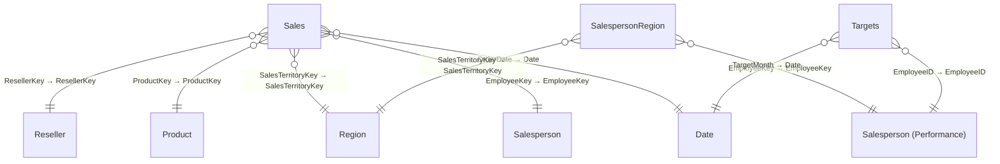

# 11-Solution-Sales Analysis

**Workspace:** SMDocTest  
**Generated:** 2026-02-12T09:20:58-05:00

## Overview
- **Model Type:** Import
- **ModelName:** Model
- **DatabaseName:** 11-Solution-Sales Analysis
- **CompatibilityLevel:** 1567
- **TableCount:** 9
- **TotalMeasureCount:** 11
- **TotalColumnCount:** 48
- **TotalPartitionCount:** 9
- **RelationshipCount:** 10
- **RoleCount:** 1
- **CultureCount:** 1
- **PerspectiveCount:** 0
- **DataSourceCount (M-derived):** 2

## Model Shape (Dimensional Modeling)

**Classification:** Star &nbsp;|&nbsp; **Confidence:** High

### Fact Tables

- Sales
- SalespersonRegion
- Targets

### Dimension Tables

- Date
- Product
- Region
- Reseller
- Salesperson
- Salesperson (Performance)

<details>
<summary>Classification Evidence</summary>

| Metric | Value |
|--------|-------|
| Total Relationships | 10 |
| Active M2O Relationships | 9 |
| M2O Ratio | 0.9 |
| Fact Table Candidates | 3 |
| Dimension Table Candidates | 6 |
| Dim To Dim Chains | 0 |

</details>

## Model Diagram



**Inactive relationships not shown (1):**

- Sales.EmployeeKey → Salesperson (Performance).EmployeeKey

## Model Quality Summary

### Relationship Risk Signals

| Signal | Count | Status |
|---|---|---|
| Total relationships | 10 | — |
| Inactive relationships | 1 | ⚠️ (1) |
| Bidirectional cross-filter | 1 | ⚠️ (1) |
| Many-to-many | 0 | ✅ |

### RLS / OLS Governance

| Metric | Value |
|---|---|
| Security roles defined | 1 |
| Total table filters | 1 |

| Role | Tables Filtered | Description |
|---|---|---|
| Salespeople | 1 | — |

<details>
<summary>Role: Salespeople — filter expressions</summary>

**Salesperson (Performance):**
```dax
[UPN] = USERPRINCIPALNAME()
```

</details>


### Model Complexity

| Metric | Value |
|---|---|
| Total tables | 7 |
| Total measures | 11 |
| Tables with measures | 2 |
| Avg measures per table | 5.5 |
| Avg DAX expression length | 39 chars |
| Max DAX expression length | 91 chars |

**Top Complex Measures** (ranked by composite score):

| Rank | Measure | DAX Length | Nesting Depth | Functions | Score |
|---|---|---|---|---|---|
| 1 | Variance | 91 | 3 | 4 | 321 |
| 2 | Target | 89 | 3 | 4 | 319 |
| 3 | Profit Margin | 37 | 2 | 2 | 177 |
| 4 | Profit | 40 | 1 | 1 | 110 |
| 5 | Orders | 38 | 1 | 1 | 108 |
| 6 | Variance Margin | 28 | 1 | 1 | 98 |
| 7 | Avg Price | 26 | 1 | 1 | 96 |
| 8 | Median Price | 25 | 1 | 1 | 95 |
| 9 | Min Price | 22 | 1 | 1 | 92 |
| 10 | Max Price | 22 | 1 | 1 | 92 |

### Naming & Organization

**Measure Placement:**

| Table | Measures |
|---|---|
| Sales | 8 |
| Targets | 3 |


**Naming Conventions:**

- PascalCase: 10 names
- Space Separated: 8 names

> ⚠️ **8 object name(s)** contain spaces. Consider using PascalCase or underscores for programmatic compatibility.

### Data Source Risk Flags

#### Likely Query-Folding Breakers *(heuristic)*

> **Note:** This analysis is based on the presence and ordering of M transformation steps. It cannot prove whether folding actually occurs — only Power Query diagnostics or SQL Profiler can confirm that. Treat these as *review candidates*, not definitive findings.

| Table | Connector | Steps | Breakers Before Filter | Detail |
|---|---|---|---|---|
| Salesperson (Performance) | `Sql.Databases` | 5 | 0 | 1 post-filter transform(s): `Table.CombineColumns` |
| Sales | `Sql.Databases` | 8 | 1 | 1 transform(s) before filter: `Table.AddColumn`; No `Table.SelectRows` filter detected — all transforms sent to client |

## Parameters & Shared Expressions

### Parameters

| Parameter | Current Value | Incremental Refresh | Description |
|---|---|---|---|
| `Database` | `AdventureWorksDW2020` | — | — |
| `SQLInstance` | `localhost` | — | — |

<details>
<summary>Parameter expressions</summary>

**Database:**
```powerquery
"AdventureWorksDW2020" meta [IsParameterQuery=true, Type="Text", IsParameterQueryRequired=true]
```

**SQLInstance:**
```powerquery
"localhost" meta [IsParameterQuery=true, Type="Text", IsParameterQueryRequired=true]
```

</details>

### Shared Expressions

| Expression | Kind | Query Group | Description |
|---|---|---|---|
| `ColorFormats` | M | — | — |

<details>
<summary>Shared expression code</summary>

**ColorFormats:**
```powerquery
let
    Source = Csv.Document(Web.Contents("https://raw.githubusercontent.com/MicrosoftLearning/PL-300-Microsoft-Power-BI-Data-Analyst/Main/Allfiles/Resources/ColorFormats.csv"),[Delimiter=",", Columns=3, Encoding=65001, QuoteStyle=QuoteStyle.None]),
    #"Changed Type" = Table.TransformColumnTypes(Source,{{"Column1", type text}, {"Column2", type text}, {"Column3", type text}}),
    #"Promoted Headers" = Table.PromoteHeaders(#"Changed Type", [PromoteAllScalars=true]),
    #"Changed Type1" = Table.TransformColumnTypes(#"Promoted Headers",{{"Color", type text}, {"Background Color Format", type text}, {"Font Color Format", type text}})
in
    #"Changed Type1"
```

</details>

## Data Sources (from Power Query)
### Source 1 — Sql.Databases
- **Connector:** `Sql.Databases`
- **Source Objects:** `dbo.FactResellerSales`
- **Raw (redacted):** `Sql.Databases(SQLInstance)`
- **Used by tables:** Product, Region, Reseller, Sales, Salesperson (Performance), SalespersonRegion

<details>
<summary>Power Query M Expression</summary>

```powerquery
let
    Source = Sql.Databases(SQLInstance),
    AdventureWorksDW2020 = Source{[Name=Database]}[Data],
    dbo_FactResellerSales = AdventureWorksDW2020{[Schema="dbo",Item="FactResellerSales"]}[Data],
    #"Removed Other Columns" = Table.SelectColumns(dbo_FactResellerSales,{"SalesOrderNumber", "OrderDate", "ProductKey", "="***REDACTED***"ResellerKey", "="***REDACTED***"EmployeeKey", "="***REDACTED***"SalesTerritoryKey", "="***REDACTED***"OrderQuantity", "UnitPrice", "TotalProductCost", "SalesAmount", "DimProduct"}),
    #"Expanded DimProduct" = Table.ExpandRecordColumn(#"Removed Other Columns", "DimProduct", {"StandardCost"}, {"StandardCost"}),
    #"Added Custom" = Table.AddColumn(#"Expanded DimProduct", "Cost", each if [TotalProductCost] = null then [OrderQuantity] * [StandardCost] else [TotalProductCost]),
    #"Removed Columns" = Table.RemoveColumns(#"Added Custom",{"StandardCost", "TotalProductCost"}),
    #"Changed Type" = Table.TransformColumnTypes(#"Removed Columns",{{"Cost", type number}}),
    #"Renamed Columns" = Table.RenameColumns(#"Changed Type",{{"OrderQuantity", "Quantity"}, {"UnitPrice", "Unit Price"}, {"SalesAmount", "Sales"}}),
    #"Changed Type1" = Table.TransformColumnTypes(#"Renamed Columns",{{"Quantity", Int64.Type}, {"Unit Price", Currency.Type}, {"Sales", Currency.Type}, {"Cost", Currency.Type}})
in
    #"Changed Type1"
```
</details>

### Source 2 — Csv.Document
- **Connector:** `Csv.Document`
- **Raw (redacted):** `Csv.Document(Web.Contents("https://raw.githubusercontent.com/MicrosoftLearning/PL-300-Microsoft-Power-BI-Data-Analyst/Main/Allfiles/Resources/ResellerSalesTargets.csv")`
- **Used by tables:** Targets

<details>
<summary>Power Query M Expression</summary>

```powerquery
let
    Source = Csv.Document(Web.Contents("https://raw.githubusercontent.com/MicrosoftLearning/PL-300-Microsoft-Power-BI-Data-Analyst/Main/Allfiles/Resources/ResellerSalesTargets.csv"),[Delimiter=",", Columns=14, Encoding=1200, QuoteStyle=QuoteStyle.None]),
    #"Promoted Headers" = Table.PromoteHeaders(Source, [PromoteAllScalars=true]),
    #"Changed Type" = Table.TransformColumnTypes(#"Promoted Headers",{{"Year", Int64.Type}, {"EmployeeID", Int64.Type}, {"M01", type text}, {"M02", type text}, {"M03", type text}, {"M04", type text}, {"M05", type text}, {"M06", type text}, {"M07", type text}, {"M08", type text}, {"M09", type text}, {"M10", type text}, {"M11", type text}, {"M12", type text}}),
    #"Unpivoted Other Columns" = Table.UnpivotOtherColumns(#"Changed Type", {"Year", "EmployeeID"}, "Attribute", "Value"),
    #"Filtered Rows" = Table.SelectRows(#"Unpivoted Other Columns", each ([Value] <> "-")),
    #"Renamed Columns" = Table.RenameColumns(#"Filtered Rows",{{"Attribute", "MonthNumber"}, {"Value", "Target"}}),
    #"Replaced Value" = Table.ReplaceValue(#"Renamed Columns","M","",Replacer.ReplaceText,{"MonthNumber"}),
    #"Changed Type1" = Table.TransformColumnTypes(#"Replaced Value",{{"MonthNumber", Int64.Type}}),
    #"Inserted Merged Column" = Table.AddColumn(#"Changed Type1", "TargetMonth", each Text.Combine({Text.From([MonthNumber], "en-US"), "/1/", Text.From([Year], "en-US")}), type text),
    #"Removed Columns" = Table.RemoveColumns(#"Inserted Merged Column",{"Y
// ... (truncated)
```
</details>

## Tables
### Product
- Sql.Databases (n/a / n/a)

### Region
- Sql.Databases (n/a / n/a)

### Reseller
- Sql.Databases (n/a / n/a)

### Sales
- Sql.Databases (n/a / n/a)

### Salesperson (Performance)
- Sql.Databases (n/a / n/a)

### SalespersonRegion
- Sql.Databases (n/a / n/a)

### Targets
- Csv.Document (n/a / n/a)

## Measures
### Sales
#### Avg Price
**Format:** `\$#,0.###############;(\$#,0.###############);\$#,0.###############`

**DAX Expression:**
```dax

AVERAGE(Sales[Unit Price])
```

#### Max Price
**Format:** `\$#,0.###############;(\$#,0.###############);\$#,0.###############`

**DAX Expression:**
```dax

MAX(Sales[Unit Price])
```

#### Median Price
**Format:** `\$#,0.###############;(\$#,0.###############);\$#,0.###############`

**DAX Expression:**
```dax

MEDIAN(Sales[Unit Price])
```

#### Min Price
**Format:** `\$#,0.###############;(\$#,0.###############);\$#,0.###############`

**DAX Expression:**
```dax

MIN(Sales[Unit Price])
```

#### Order Lines
**Format:** `0`

**DAX Expression:**
```dax

COUNTROWS(Sales)
```

#### Orders
**Format:** `0`

**DAX Expression:**
```dax

DISTINCTCOUNT(Sales[SalesOrderNumber])
```

#### Profit
**Format:** `\$#,0;(\$#,0);\$#,0`

**DAX Expression:**
```dax

SUM('Sales'[Sales]) - SUM('Sales'[Cost])
```

#### Profit Margin
**Format:** `#,0.00%;-#,0.00%;#,0.00%`

**DAX Expression:**
```dax

DIVIDE([Profit], SUM('Sales'[Sales]))
```


### Targets
#### Target
**Format:** `\$#,0;(\$#,0);\$#,0`

**DAX Expression:**
```dax

IF(
	HASONEVALUE('Salesperson (Performance)'[Salesperson]),
	SUM(Targets[TargetAmount])
)
```

#### Variance
**Format:** `\$#,0;(\$#,0);\$#,0`

**DAX Expression:**
```dax

IF(
	HASONEVALUE('Salesperson (Performance)'[Salesperson]),
	SUM(Sales[Sales]) - [Target]
)
```

#### Variance Margin
**Format:** `0.00%;-0.00%;0.00%`

**DAX Expression:**
```dax

DIVIDE([Variance], [Target])
```


