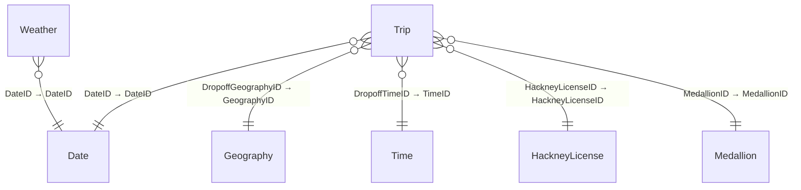

# NYC Taxi - DQ

**Workspace:** SMDocTest  
**Generated:** 2026-02-12T14:36:42-05:00

## Overview
- **Model Type:** DirectQuery
- **ModelName:** Model
- **DatabaseName:** NYC Taxi - DQ
- **CompatibilityLevel:** 1600
- **TableCount:** 7
- **TotalMeasureCount:** 5
- **TotalColumnCount:** 81
- **TotalPartitionCount:** 7
- **RelationshipCount:** 6
- **RoleCount:** 0
- **CultureCount:** 1
- **PerspectiveCount:** 0
- **DataSourceCount (M-derived):** 1

## Model Shape (Dimensional Modeling)

**Classification:** Star &nbsp;|&nbsp; **Confidence:** High

### Fact Tables

- Trip
- Weather

### Dimension Tables

- Date
- Geography
- HackneyLicense
- Medallion
- Time

<details>
<summary>Classification Evidence</summary>

| Metric | Value |
|--------|-------|
| Total Relationships | 6 |
| Active M2O Relationships | 6 |
| M2O Ratio | 1.0 |
| Fact Table Candidates | 2 |
| Dimension Table Candidates | 5 |
| Dim To Dim Chains | 0 |

</details>

## Model Diagram



## Model Quality Summary

### Relationship Risk Signals

| Signal | Count | Status |
|---|---|---|
| Total relationships | 6 | — |
| Inactive relationships | 0 | ✅ |
| Bidirectional cross-filter | 0 | ✅ |
| Many-to-many | 0 | ✅ |

### RLS / OLS Governance

| Metric | Value |
|---|---|
| Security roles defined | **None** |

> ⚠️ No Row-Level Security roles are defined on this model.

### Model Complexity

| Metric | Value |
|---|---|
| Total tables | 7 |
| Total measures | 5 |
| Tables with measures | 1 |
| Avg measures per table | 5.0 |
| Avg DAX expression length | 21 chars |
| Max DAX expression length | 26 chars |

**Top Complex Measures** (ranked by composite score):

| Rank | Measure | DAX Length | Nesting Depth | Functions | Score |
|---|---|---|---|---|---|
| 1 | average revenue per trip | 26 | 1 | 1 | 96 |
| 2 | Average Fare Per Trip | 25 | 1 | 1 | 95 |
| 3 | TotalFare | 21 | 1 | 1 | 91 |
| 4 | Trips | 15 | 1 | 1 | 85 |
| 5 | Revenue | 22 | 1 | 0 | 72 |

### Naming & Organization

**Measure Placement:**

| Table | Measures |
|---|---|
| Trip | 5 |


**Naming Conventions:**

- PascalCase: 10 names
- Space Separated: 2 names

> ⚠️ **2 object name(s)** contain spaces. Consider using PascalCase or underscores for programmatic compatibility.

### Data Source Risk Flags

✅ No data-source risk flags detected.

## Parameters & Shared Expressions

*No named expressions or parameters defined in this model.*

## Data Sources (from Power Query)
### Source 1 — Sql.Database
- **Connector:** `Sql.Database`
- **Host/Server:** `rddhezwna3wutjobbbcron4k6e-vepdvwfqpavevgmawk5vs6h23e.database.fabric.microsoft.com`
- **Database/Catalog:** `FoldingDemo-47385673-59b2-4c32-9e8e-4c383aa2b2a7`
- **Source Objects:** `dbo.Weather`
- **Raw (redacted):** `Sql.Database("rddhezwna3wutjobbbcron4k6e-vepdvwfqpavevgmawk5vs6h23e.database.fabric.microsoft.com", "FoldingDemo-47385673-59b2-4c32-9e8e-4c383aa2b2a7")`
- **Used by tables:** Date, Geography, HackneyLicense, Medallion, Time, Trip, Weather

<details>
<summary>Power Query M Expression</summary>

```powerquery
let
    Source = Sql.Database("rddhezwna3wutjobbbcron4k6e-vepdvwfqpavevgmawk5vs6h23e.database.fabric.microsoft.com", "FoldingDemo-47385673-59b2-4c32-9e8e-4c383aa2b2a7"),
    dbo_Weather = Source{[Schema="dbo",Item="Weather"]}[Data]
in
    dbo_Weather
```
</details>

## Tables
### Date
- Sql.Database (rddhezwna3wutjobbbcron4k6e-vepdvwfqpavevgmawk5vs6h23e.database.fabric.microsoft.com / FoldingDemo-47385673-59b2-4c32-9e8e-4c383aa2b2a7)

### Geography
- Sql.Database (rddhezwna3wutjobbbcron4k6e-vepdvwfqpavevgmawk5vs6h23e.database.fabric.microsoft.com / FoldingDemo-47385673-59b2-4c32-9e8e-4c383aa2b2a7)

### HackneyLicense
- Sql.Database (rddhezwna3wutjobbbcron4k6e-vepdvwfqpavevgmawk5vs6h23e.database.fabric.microsoft.com / FoldingDemo-47385673-59b2-4c32-9e8e-4c383aa2b2a7)

### Medallion
- Sql.Database (rddhezwna3wutjobbbcron4k6e-vepdvwfqpavevgmawk5vs6h23e.database.fabric.microsoft.com / FoldingDemo-47385673-59b2-4c32-9e8e-4c383aa2b2a7)

### Time
- Sql.Database (rddhezwna3wutjobbbcron4k6e-vepdvwfqpavevgmawk5vs6h23e.database.fabric.microsoft.com / FoldingDemo-47385673-59b2-4c32-9e8e-4c383aa2b2a7)

### Trip
- Sql.Database (rddhezwna3wutjobbbcron4k6e-vepdvwfqpavevgmawk5vs6h23e.database.fabric.microsoft.com / FoldingDemo-47385673-59b2-4c32-9e8e-4c383aa2b2a7)

### Weather
- Sql.Database (rddhezwna3wutjobbbcron4k6e-vepdvwfqpavevgmawk5vs6h23e.database.fabric.microsoft.com / FoldingDemo-47385673-59b2-4c32-9e8e-4c383aa2b2a7)

## Measures
### Trip
#### Average Fare Per Trip
**DAX Expression:**
```dax
AVERAGE(Trip[FareAmount])
```

#### Revenue
**DAX Expression:**
```dax
sum(Trip[TotalAmount])
```

#### TotalFare
**Format:** `\$#,0.00;(\$#,0.00);\$#,0.00`

**DAX Expression:**
```dax
SUM(Trip[FareAmount])
```

#### Trips
**Format:** `0`

**DAX Expression:**
```dax
COUNTROWS(Trip)
```

#### average revenue per trip
**DAX Expression:**
```dax
AVERAGE(Trip[TotalAmount])
```


