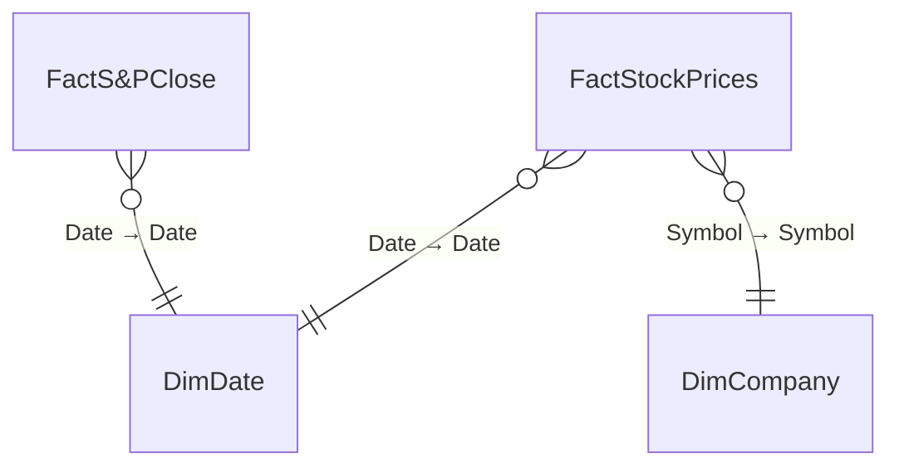

# S&P Company Report

**Workspace:** SMDocTest  
**Generated:** 2026-02-12T09:20:26-05:00

## Overview
- **Model Type:** Import
- **ModelName:** Model
- **DatabaseName:** S_P Company Report
- **CompatibilityLevel:** 1567
- **TableCount:** 4
- **TotalMeasureCount:** 8
- **TotalColumnCount:** 32
- **TotalPartitionCount:** 4
- **RelationshipCount:** 3
- **RoleCount:** 0
- **CultureCount:** 1
- **PerspectiveCount:** 0
- **DataSourceCount (M-derived):** 3

## Model Shape (Dimensional Modeling)

**Classification:** Star &nbsp;|&nbsp; **Confidence:** High

### Fact Tables

- FactS&PClose
- FactStockPrices

### Dimension Tables

- DimCompany
- DimDate

<details>
<summary>Classification Evidence</summary>

| Metric | Value |
|--------|-------|
| Total Relationships | 3 |
| Active M2O Relationships | 3 |
| M2O Ratio | 1.0 |
| Fact Table Candidates | 2 |
| Dimension Table Candidates | 2 |
| Dim To Dim Chains | 0 |

</details>

## Model Diagram



## Model Quality Summary

### Relationship Risk Signals

| Signal | Count | Status |
|---|---|---|
| Total relationships | 3 | — |
| Inactive relationships | 0 | ✅ |
| Bidirectional cross-filter | 0 | ✅ |
| Many-to-many | 0 | ✅ |

### RLS / OLS Governance

| Metric | Value |
|---|---|
| Security roles defined | **None** |

> ⚠️ No Row-Level Security roles are defined on this model.

### Model Complexity

| Metric | Value |
|---|---|
| Total tables | 3 |
| Total measures | 8 |
| Tables with measures | 2 |
| Avg measures per table | 4.0 |
| Avg DAX expression length | 46 chars |
| Max DAX expression length | 81 chars |

**Top Complex Measures** (ranked by composite score):

| Rank | Measure | DAX Length | Nesting Depth | Functions | Score |
|---|---|---|---|---|---|
| 1 | StartPrice | 81 | 3 | 3 | 291 |
| 2 | MostRecentPrice | 80 | 3 | 3 | 290 |
| 3 | Company Overview Title | 56 | 1 | 1 | 126 |
| 4 | YTD Change | 40 | 1 | 1 | 110 |
| 5 | Closing Price | 31 | 1 | 1 | 101 |
| 6 | P/E Ratio | 32 | 1 | 0 | 82 |
| 7 | Market Cap | 26 | 1 | 0 | 76 |
| 8 | Earnings | 23 | 1 | 0 | 73 |

### Naming & Organization

**Measure Placement:**

| Table | Measures |
|---|---|
| DimCompany | 4 |
| FactStockPrices | 4 |


**Naming Conventions:**

- PascalCase: 5 names
- Space Separated: 5 names
- Mixed: 1 names

> ⚠️ **5 object name(s)** contain spaces. Consider using PascalCase or underscores for programmatic compatibility.

### Data Source Risk Flags

#### Non-Portable Source Paths

| Table | Path | Risk |
|---|---|---|
| DimCompany | `C:\Users\KevinFeit\OneDrive - Spyglass S...Firmwide Adoption\sp500_companies.csv` | Non-portable source path · Service refresh risk |
| FactS&PClose | `C:\Users\KevinFeit\OneDrive - Spyglass S...PBI Firmwide Adoption\sp500_index.csv` | Non-portable source path · Service refresh risk |
| FactStockPrices | `C:\Users\KevinFeit\OneDrive - Spyglass S...BI Firmwide Adoption\sp500_stocks.csv` | Non-portable source path · Service refresh risk |

> ⚠️ Local file paths prevent scheduled refresh in the Fabric service. Migrate to SharePoint, OneLake, or a gateway-backed connection.

## Parameters & Shared Expressions

*No named expressions or parameters defined in this model.*

## Data Sources (from Power Query)
### Source 1 — Csv.Document
- **Connector:** `Csv.Document`
- **Raw (redacted):** `Csv.Document(File.Contents("C:\Users\KevinFeit\OneDrive - Spyglass Solutions, Inc\Documents\Baupost\PBI Firmwide Adoption\sp500_companies.csv")`
- **Used by tables:** DimCompany

<details>
<summary>Power Query M Expression</summary>

```powerquery
let
    Source = Csv.Document(File.Contents("C:\Users\KevinFeit\OneDrive - Spyglass Solutions, Inc\Documents\Baupost\PBI Firmwide Adoption\sp500_companies.csv"),[Delimiter=",", Columns=16, Encoding=65001, QuoteStyle=QuoteStyle.None]),
    #"Promoted Headers" = Table.PromoteHeaders(Source, [PromoteAllScalars=true]),
    #"Changed Type" = Table.TransformColumnTypes(#"Promoted Headers",{{"Exchange", type text}, {"Symbol", type text}, {"Shortname", type text}, {"Longname", type text}, {"Sector", type text}, {"Industry", type text}, {"Currentprice", type number}, {"Marketcap", Int64.Type}, {"Ebitda", Int64.Type}, {"Revenuegrowth", type number}, {"City", type text}, {"State", type text}, {"Country", type text}, {"Fulltimeemployees", Int64.Type}, {"Longbusinesssummary", type text}, {"Weight", type number}})
in
    #"Changed Type"
```
</details>

### Source 2 — Csv.Document
- **Connector:** `Csv.Document`
- **Raw (redacted):** `Csv.Document(File.Contents("C:\Users\KevinFeit\OneDrive - Spyglass Solutions, Inc\Documents\Baupost\PBI Firmwide Adoption\sp500_index.csv")`
- **Used by tables:** FactS&PClose

<details>
<summary>Power Query M Expression</summary>

```powerquery
let
    Source = Csv.Document(File.Contents("C:\Users\KevinFeit\OneDrive - Spyglass Solutions, Inc\Documents\Baupost\PBI Firmwide Adoption\sp500_index.csv"),[Delimiter=",", Columns=2, Encoding=1252, QuoteStyle=QuoteStyle.None]),
    #"Promoted Headers" = Table.PromoteHeaders(Source, [PromoteAllScalars=true]),
    #"Changed Type" = Table.TransformColumnTypes(#"Promoted Headers",{{"Date", type date}, {"S&P500", type number}}),
    #"Renamed Columns" = Table.RenameColumns(#"Changed Type",{{"S&P500", "ClosingPrice"}})
in
    #"Renamed Columns"
```
</details>

### Source 3 — Csv.Document
- **Connector:** `Csv.Document`
- **Raw (redacted):** `Csv.Document(File.Contents("C:\Users\KevinFeit\OneDrive - Spyglass Solutions, Inc\Documents\Baupost\PBI Firmwide Adoption\sp500_stocks.csv")`
- **Used by tables:** FactStockPrices

<details>
<summary>Power Query M Expression</summary>

```powerquery
let
    Source = Csv.Document(File.Contents("C:\Users\KevinFeit\OneDrive - Spyglass Solutions, Inc\Documents\Baupost\PBI Firmwide Adoption\sp500_stocks.csv"),[Delimiter=",", Columns=8, Encoding=1252, QuoteStyle=QuoteStyle.None]),
    #"Promoted Headers" = Table.PromoteHeaders(Source, [PromoteAllScalars=true]),
    #"Changed Type" = Table.TransformColumnTypes(#"Promoted Headers",{{"Date", type date}, {"Symbol", type text}, {"Adj Close", type number}, {"Close", type number}, {"High", type number}, {"Low", type number}, {"Open", type number}, {"Volume", Int64.Type}})
in
    #"Changed Type"
```
</details>

## Tables
### DimCompany
- Csv.Document (n/a / n/a)

### FactS&PClose
- Csv.Document (n/a / n/a)

### FactStockPrices
- Csv.Document (n/a / n/a)

## Measures
### DimCompany
#### Company Overview Title
**DAX Expression:**
```dax
SELECTEDVALUE(DimCompany[Company]) & " Company Overview"
```

#### Earnings
**Format:** `0`

**DAX Expression:**
```dax
sum(DimCompany[Ebitda])
```

#### Market Cap
**Format:** `\$#,0;(\$#,0);\$#,0`

**DAX Expression:**
```dax
sum(DimCompany[Marketcap])
```

#### P/E Ratio
**DAX Expression:**
```dax
divide([Market Cap], [Earnings])
```


### FactStockPrices
#### Closing Price
**DAX Expression:**
```dax
AVERAGE(FactStockPrices[Close])
```

#### MostRecentPrice
**DAX Expression:**
```dax
CALCULATE(sum(FactStockPrices[Close]),LASTDATE(DATESYTD(FactStockPrices[Date])))
```

#### StartPrice
**DAX Expression:**
```dax
CALCULATE(sum(FactStockPrices[Close]),FIRSTDATE(DATESYTD(FactStockPrices[Date])))
```

#### YTD Change
**Format:** `0.00%;-0.00%;0.00%`

**DAX Expression:**
```dax
DIVIDE([MostRecentPrice],[StartPrice])-1
```


