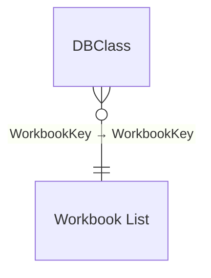

# TableauWorkbooks

**Workspace:** SMDocTest  
**Generated:** 2026-02-12T10:24:05-05:00

## Overview
- **Model Type:** Import
- **ModelName:** Model
- **DatabaseName:** TableauWorkbooks
- **CompatibilityLevel:** 1567
- **TableCount:** 4
- **TotalMeasureCount:** 2
- **TotalColumnCount:** 49
- **TotalPartitionCount:** 4
- **RelationshipCount:** 2
- **RoleCount:** 0
- **CultureCount:** 1
- **PerspectiveCount:** 0
- **DataSourceCount (M-derived):** 1

## Model Shape (Dimensional Modeling)

**Classification:** Star &nbsp;|&nbsp; **Confidence:** Low

### Fact Tables

- DBClass
- Workbook List

### Dimension Tables

- LocalDateTable_77ad99dc-2ba6-434a-b3f3-9ea273a89e0c

<details>
<summary>Classification Evidence</summary>

| Metric | Value |
|--------|-------|
| Total Relationships | 2 |
| Active M2O Relationships | 2 |
| M2O Ratio | 1.0 |
| Fact Table Candidates | 2 |
| Dimension Table Candidates | 1 |
| Dim To Dim Chains | 0 |

</details>

## Model Diagram



**Hidden tables excluded (1):**

- LocalDateTable_77ad99dc-2ba6-434a-b3f3-9ea273a89e0c

## Model Quality Summary

### Relationship Risk Signals

| Signal | Count | Status |
|---|---|---|
| Total relationships | 2 | — |
| Inactive relationships | 0 | ✅ |
| Bidirectional cross-filter | 1 | ⚠️ (1) |
| Many-to-many | 0 | ✅ |

### RLS / OLS Governance

| Metric | Value |
|---|---|
| Security roles defined | **None** |

> ⚠️ No Row-Level Security roles are defined on this model.

### Model Complexity

| Metric | Value |
|---|---|
| Total tables | 2 |
| Total measures | 2 |
| Tables with measures | 1 |
| Avg measures per table | 2.0 |
| Avg DAX expression length | 38 chars |
| Max DAX expression length | 43 chars |

**Top Complex Measures** (ranked by composite score):

| Rank | Measure | DAX Length | Nesting Depth | Functions | Score |
|---|---|---|---|---|---|
| 1 | Workbooks | 43 | 1 | 1 | 113 |
| 2 | Sheets | 33 | 1 | 0 | 83 |

### Naming & Organization

**Measure Placement:**

| Table | Measures |
|---|---|
| Workbook List | 2 |


**Naming Conventions:**

- PascalCase: 3 names
- Space Separated: 1 names

> ⚠️ **1 object name(s)** contain spaces. Consider using PascalCase or underscores for programmatic compatibility.

### Data Source Risk Flags

#### Non-Portable Source Paths

| Table | Path | Risk |
|---|---|---|
| Workbook List | `C:\Users\KevinFeit\OneDrive - Spyglass S...uments\BMS\Working Sessions List.xlsx` | Non-portable source path · Service refresh risk |

> ⚠️ Local file paths prevent scheduled refresh in the Fabric service. Migrate to SharePoint, OneLake, or a gateway-backed connection.

## Parameters & Shared Expressions

*No named expressions or parameters defined in this model.*

## Data Sources (from Power Query)
### Source 1 — Excel.Workbook
- **Connector:** `Excel.Workbook`
- **Source Objects:** `Workbook List`
- **Raw (redacted):** `Excel.Workbook(File.Contents("C:\Users\KevinFeit\OneDrive - Spyglass Solutions, Inc\Documents\BMS\Working Sessions List.xlsx")`
- **Used by tables:** Workbook List

<details>
<summary>Power Query M Expression</summary>

```powerquery
let
    Source = Excel.Workbook(File.Contents("C:\Users\KevinFeit\OneDrive - Spyglass Solutions, Inc\Documents\BMS\Working Sessions List.xlsx"), null, true),
    #"Workbook List_Sheet" = Source{[Item="Workbook List",Kind="Sheet"]}[Data],
    #"Promoted Headers" = Table.PromoteHeaders(#"Workbook List_Sheet", [PromoteAllScalars=true]),
    #"Changed Type" = Table.TransformColumnTypes(#"Promoted Headers",{{"region", type text}, {"workbook_id", Int64.Type}, {"workbook_name", type text}, {"workbook_url", type text}, {"sheet_count", Int64.Type}, {"data_connection_count", Int64.Type}, {"site_id", Int64.Type}, {"latest_access_date", type date}, {"user_view_count", Int64.Type}, {"unique_user_access_count", Int64.Type}, {"owner_name", type text}, {"email", type text}, {"whitepages_mgr_full_nm", type text}, {"manager_lvl_3", type text}, {"manager_lvl_4", type text}, {"manager_lvl_5", type text}, {"org_lvl_3", type text}, {"org_lvl_4", type text}, {"org_lvl_5", type text}, {"db_class_list", type text}, {"data_source_type_score", Int64.Type}, {"180_day_filter", type text}, {"days_since_last_accessed", Int64.Type}, {"score_data_connections", Int64.Type}, {"score_usage_days", Int64.Type}, {"score_recency_use", Int64.Type}, {"score_db_type", Int64.Type}, {"complexity_score", Int64.Type}, {"criticality_score", Int64.Type}, {"total_score", Int64.Type}, {"tranche", type text}, {"complexity_category", type text}, {"criticality_category", type text}, {"mission_critical", type any}, {"gxp_validate
// ... (truncated)
```
</details>

## Tables
### DBClass
- No sources detected

### Workbook List
- Excel.Workbook (n/a / n/a)

## Measures
### Workbook List
#### Sheets
**Format:** `0`

**DAX Expression:**
```dax
sum('Workbook List'[sheet_count])
```

#### Workbooks
**Format:** `0`

**DAX Expression:**
```dax
DISTINCTCOUNT('Workbook List'[WorkbookKey])
```


